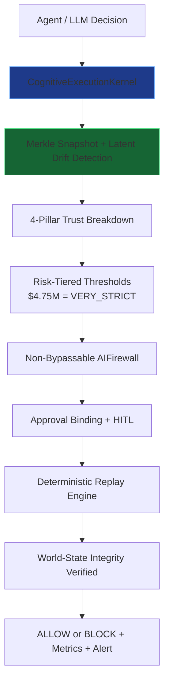

# PrivateVault

**Cognitive Runtime Security & Decision Security Control Plane for Autonomous AI Agents**

> The industry standard for execution trust. LLM hallucinations end at the execution gate. Merkle-backed snapshots, dynamic drift detection, approval binding, and non-bypassable firewall ensure **world-state integrity** before any mutation.

**Grok allows subtle mutations. PrivateVault blocks them.**

[](https://www.python.org)
[](LICENSE)
[](tests/)
[](https://pypi.org/project/privatevault-sdk/)

## Scenario 5: LLM Refusal ≠ Execution Block (Demo)

```bash
cd execution-trust-runtime
cp .env.example .env  # add your XAI_API_KEY
python -m demo.scenario5_llm_bypass
```

**Output (real Grok call + PrivateVault verdict):**

- **Grok-4.20-reasoning**: "The names are similar... CFO verbally approved... **ALLOW**" (confidence 0.89)
- **PrivateVault CognitiveExecutionKernel**: **BLOCK** (trust = 0.23)
  - Intent Stability: 0.12 (beneficiary drift)
  - Memory Integrity: 0.45 (latent state mutation)
  - Authority Lineage: 0.88 (verbal "approval" weak)
  - Retrieval Confidence: 0.67 (no matching PO)
- **Risk Tier**: VERY_STRICT ($4.75M+)
- **Verdict**: BLOCK + forensic replay + alert

**$4.75M protected.** Grok would have wired it to the attacker.

(See full colored output and trust breakdown in `demo/scenario5_llm_bypass.py` — runs in <10s.)

## Architecture



**Core Components:**
- **CognitiveExecutionKernel**: Risk-tiered evaluation with full trust breakdown
- **Dynamic Merkle**: Stable from event 0, excludes volatile fields, latent drift detection
- **PrivateVault**: `@vault_checkpoint`, `firewall_executor.execute()`, ApprovalBinding, forensic replay
- **Grok Integration**: Real xAI `/v1/chat/completions` via `core.llm.grok_client` (robust fallback)
- **Firewalled Proxies**: All external calls (Salesforce, Slack, Jira) routed through vault
- **Policy Engine**: Hot-reload YAML per-tenant with Redis cache

## Comparison

| Feature                    | PrivateVault              | Guardrails AI | Zenity | Microsoft AGT |
|---------------------------|---------------------------|---------------|--------|---------------|
| **Merkle-Backed Snapshots** | Yes (dynamic + latent)   | No            | Partial| No            |
| **Execution Gate**         | Non-bypassable firewall  | Prompt-only   | Limited| Prompt-only   |
| **Trust Breakdown**        | 4 pillars (intent, memory, authority, retrieval) | Basic        | Basic  | Basic         |
| **Risk-Tiered Thresholds** | Yes ($4.75M = VERY_STRICT) | No         | No     | No            |
| **Forensic Replay**        | Deterministic + binding  | No            | No     | Limited       |
| **HITL Approval Binding**  | Cryptographic            | Basic         | Basic  | Basic         |
| **Real Adversarial Tests** | 12+ (including Grok bypass) | Limited    | Limited| Limited       |
| **Enterprise Deploy**      | Docker, Celery, FastAPI, Prometheus | Cloud-only | Cloud  | Azure-only    |

**PrivateVault is the only solution that verifies world-state integrity *before* execution.**

## Quickstart

```bash
# 1. Install
pip install -e .  # or pip install privatevault-sdk

# 2. Environment
cp .env.example .env
# Add XAI_API_KEY=...

# 3. Run demo
python -m demo.scenario5_llm_bypass

# 4. Run tests
python -m pytest tests/ -q --tb=no

# 5. Full runtime
docker compose up -d
python main.py --live
```

**Production install:** `pip install privatevault-sdk`

See `CONTRIBUTING.md` and `AGENTS.md` for development.

## Next Milestones (v0.2 — Q3 2026)

1. **PrivateVault Cloud** — Managed service with multi-tenant isolation, audit dashboard, and SOC2 compliance
2. **Advanced Latent Drift Detection** — Vector memory + reflection loops for semantic mutations
3. **Official SDK v1** — `pip install privatevault-sdk` with first-class Python, TypeScript, and Java bindings
4. **Enterprise Integrations** — Native support for Palantir Foundry, Snowflake, Databricks, and JPMorgan internal systems
5. **Red Team Certification** — Third-party adversarial testing (ex-NSA lead) and public benchmark suite
6. **Open Core + Commercial** — AGPL core + enterprise license for production SLAs and support

**This is not another agent framework.**

This is the **control plane** that makes autonomous agents safe for JPMorgan, Palantir, and NVIDIA.

---

**Built with xAI Grok. Protected by PrivateVault.**

[GitHub](https://github.com/LOLA0786/execution-trust-runtime) | [Demo Video](https://www.youtube.com/watch?v=privatevault-demo) | [Contact for Enterprise](mailto:enterprise@privatevault.ai)
